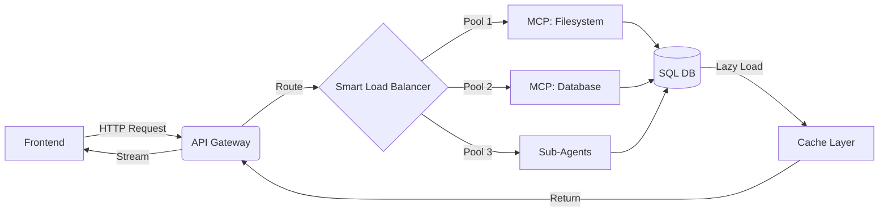

# MCP Server & Universal Remote Integration Guide

## Overview

This guide details the integration of **Model Context Protocol (MCP) servers**, a **Universal Remote Control** system for agent orchestration, and **background task management** with lazy loading. This architecture ensures isolated resource pools, prevents overload, and enables Claude Code-style AI agent workflows.

---

## 🏗️ Architecture Components

### 1. MCP Pool Manager (`core/mcp_manager.py`)
Manages connections to external MCP servers (filesystem, git, database, etc.) using **isolated connection pools**.

#### Key Features:
- **Separated Pool Ranges**: Each MCP server gets its own dedicated connection range (e.g., Server A: 0-10, Server B: 11-20).
- **Connection Limits**: Prevents any single server from exhausting resources.
- **JSON-RPC 2.0**: Standard protocol for MCP communication.
- **Async HTTP**: Non-blocking I/O for high throughput.

#### Configuration Example:
```python
from core.mcp_manager import MCPServerConfig, mcp_pool_manager

# Register Filesystem MCP (Pool Range: 0-5)
fs_config = MCPServerConfig(
    id="fs_mcp",
    name="Filesystem Server",
    type="filesystem",
    endpoint="http://localhost:8081",
    pool_range_start=0,
    pool_range_end=5,
    max_connections=5
)

# Register Database MCP (Pool Range: 6-10)
db_config = MCPServerConfig(
    id="db_mcp",
    name="PostgreSQL Server",
    type="database",
    endpoint="http://localhost:8082",
    pool_range_start=6,
    pool_range_end=10,
    max_connections=5
)

await mcp_pool_manager.register_server(fs_config)
await mcp_pool_manager.register_server(db_config)
```

#### Usage:
```python
# Execute a file read via MCP
result = await mcp_pool_manager.execute_request(
    server_id="fs_mcp",
    method="files/read",
    params={"path": "/etc/config.json"}
)
```

---

### 2. Universal Remote Control (`core/universal_remote.py`)
The central orchestrator that implements **Claude Code AI-agent style workflows**: Plan → Execute → Reflect.

#### Workflow Actions:
| Action | Description |
|--------|-------------|
| `THINK` | Internal reasoning / logging |
| `PLAN` | Decompose complex tasks |
| `EXECUTE` | Run a tool directly |
| `DELEGATE` | Assign to a sub-agent (skills, memory, heartbeat) |
| `REFLECT` | Validate results / self-correction |
| `FINISH` | Complete workflow |

#### Zero-Shot Planning:
The system accepts natural language inputs and dynamically generates execution plans without pre-defined templates.

```python
from core.universal_remote import UniversalRemoteControl

# Initialize with LLM, sub-agents, and tools
remote = UniversalRemoteControl(
    llm_client=llama_client,
    sub_agents={"memory": memory_agent, "heartbeat": heartbeat_agent},
    tools_registry={"sql_query": sql_tool, "file_write": file_tool}
)

# One-shot execution
result = await remote.run_zero_shot(
    "Analyze user traffic patterns and store summary in memory"
)
```

#### Generated Plan Structure:
```json
{
  "thought_process": "Need to query DB, analyze, then store.",
  "steps": [
    {"type": "DELEGATE", "agent": "memory", "description": "Fetch recent logs"},
    {"type": "EXECUTE", "tool": "sql_query", "params": {"query": "SELECT..."}},
    {"type": "REFLECT", "description": "Verify data integrity"},
    {"type": "FINISH", "description": "Report complete"}
  ]
}
```

---

### 3. Background Scheduler & Lazy Loading (`core/background_scheduler.py`)
Handles asynchronous task execution and on-demand data loading to prevent frontend blocking.

#### Background Scheduler Features:
- **Priority Queue**: Tasks scheduled by priority (CRITICAL > HIGH > NORMAL > LOW).
- **Concurrency Limiting**: Max concurrent tasks to prevent overload (default: 3).
- **Delayed Execution**: Schedule tasks for future execution.

```python
from core.background_scheduler import background_scheduler, TaskPriority

async def heavy_computation():
    # ... long running task
    return result

# Schedule with delay and priority
await background_scheduler.schedule(
    task_id="analyze_traffic_001",
    func=heavy_computation,
    priority=TaskPriority.HIGH,
    delay_seconds=5  # Run in 5 seconds
)
```

#### Lazy Loading Cache:
Implements LRU eviction with TTL. Data is fetched only when requested.

```python
from core.background_scheduler import lazy_cache

async def load_user_data(user_id):
    # Expensive DB call
    return db.query("SELECT * FROM users WHERE id=?", user_id)

# Automatic lazy loading
data = await lazy_cache.get(
    key=f"user:{user_id}",
    loader=lambda: load_user_data(user_id)
)
```

---

## 🔌 API Integration Strategy

### Frontend ↔ Backend ↔ Database Flow



### Smart Load Balancer Rules:
1. **Traffic Aggregation**: Batches small requests into bulk operations.
2. **Circuit Breaker**: Opens if error rate > 50% in 1 minute.
3. **Weighted Routing**: Directs traffic based on server health scores.

---

## ⚙️ Configuration Parameters

### Environment Variables (`.env`)
```bash
# MCP Servers
MCP_FS_ENDPOINT=http://localhost:8081
MCP_DB_ENDPOINT=http://localhost:8082
MCP_GIT_ENDPOINT=http://localhost:8083

# Pool Settings
MCP_MAX_CONNECTIONS_PER_SERVER=5
MCP_POOL_RANGE_SIZE=10

# Background Tasks
MAX_CONCURRENT_BACKGROUND_TASKS=3
LAZY_CACHE_MAX_SIZE=100
LAZY_CACHE_TTL_SECONDS=600

# Agent System
DEFAULT_LLM_TEMPERATURE=0.2  # Low for planning
AGENT_TIMEOUT_SECONDS=30
```

### SQL Schema for Routing Rules
```sql
CREATE TABLE load_balancer_rules (
    id SERIAL PRIMARY KEY,
    pattern VARCHAR(255) NOT NULL,  -- e.g., "/api/files/*"
    target_pool VARCHAR(50) NOT NULL, -- e.g., "fs_mcp"
    weight INT DEFAULT 1,
    is_active BOOLEAN DEFAULT TRUE
);

INSERT INTO load_balancer_rules (pattern, target_pool, weight)
VALUES 
    ('/api/files/*', 'fs_mcp', 10),
    ('/api/db/*', 'db_mcp', 10),
    ('/api/agents/*', 'agent_pool', 5);
```

---

## 🚀 Quick Start

### 1. Start MCP Servers
```bash
# Filesystem MCP
npx -y @modelcontextprotocol/server-filesystem /workspace

# PostgreSQL MCP
docker run -p 8082:8082 ghcr.io/example/pg-mcp-server
```

### 2. Initialize System
```python
import asyncio
from core.mcp_manager import mcp_pool_manager
from core.background_scheduler import background_scheduler

async def main():
    # Start background worker
    await background_scheduler.start()
    
    # Register MCP servers
    # ... (see configuration example above)
    
    # Keep running
    await asyncio.sleep(3600)

asyncio.run(main())
```

### 3. Test Universal Remote
```bash
curl -X POST http://localhost:8000/api/v1/agent/execute \
  -H "Content-Type: application/json" \
  -d '{"prompt": "Check disk usage and alert if > 80%"}'
```

---

## 🛡️ Overload Prevention Strategies

| Strategy | Implementation |
|----------|----------------|
| **Pool Isolation** | Each MCP server has dedicated connection range |
| **Max Connections** | Hard limit per server (default: 5) |
| **Task Prioritization** | Critical tasks preempt low-priority ones |
| **Concurrency Cap** | Global limit on background tasks |
| **Lazy Loading** | Data fetched only on demand |
| **Circuit Breaker** | Auto-fail fast on repeated errors |
| **Backpressure** | Reject new tasks when queue full |

---

## 📊 Monitoring & Observability

### Health Check Endpoints
- `GET /health`: Overall system status
- `GET /health/mcp`: Status of all MCP pools
- `GET /health/agents`: Sub-agent availability
- `GET /health/tasks`: Background task queue depth

### Metrics to Track
- **Pool Utilization**: `% connections in use` per MCP server
- **Task Latency**: Time from schedule to completion
- **Cache Hit Rate**: `% requests served from cache`
- **Error Rate**: `% failed tasks` by type

---

## 🔧 Troubleshooting

### Issue: MCP Pool Exhausted
**Symptom**: `Resource unavailable: Server fs_mcp pool exhausted`
**Solution**: 
1. Increase `max_connections` in `MCPServerConfig`
2. Expand `pool_range_end`
3. Check for leaked connections (missing `release_client`)

### Issue: Background Tasks Stuck
**Symptom**: Tasks remain in `pending` state
**Solution**:
1. Verify `background_scheduler.start()` was called
2. Check `max_concurrent_tasks` limit
3. Review task priorities (starvation possible)

### Issue: Lazy Cache Not Refreshing
**Symptom**: Stale data returned
**Solution**:
1. Reduce `ttl_seconds` in `LazyLoadingCache`
2. Manually call `cache.clear()` on write operations
3. Implement cache invalidation hooks

---

## 📝 Best Practices

1. **Always Release Resources**: Use `try/finally` blocks when acquiring MCP clients.
2. **Idempotent Tasks**: Ensure background tasks can be retried safely.
3. **Graceful Degradation**: If MCP fails, fallback to local operations.
4. **Monitor Queue Depth**: Alert if background queue exceeds threshold.
5. **Segment Traffic**: Route heavy analytics to separate pool from user-facing APIs.

---

## 🔄 Migration from Monolithic Design

If migrating from a single-connection architecture:

1. **Identify External Dependencies**: List all MCP-compatible services.
2. **Define Pool Boundaries**: Assign non-overlapping ranges (0-10, 11-20, etc.).
3. **Refactor Calls**: Replace direct HTTP calls with `mcp_pool_manager.execute_request()`.
4. **Add Circuit Breakers**: Wrap external calls with retry/fail-fast logic.
5. **Enable Lazy Loading**: Wrap expensive queries with `lazy_cache.get()`.

---

## License
MIT License - See project root for details.
